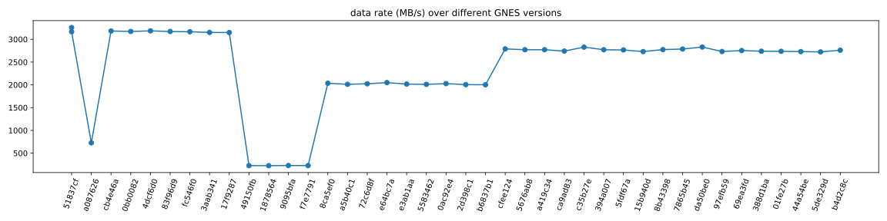
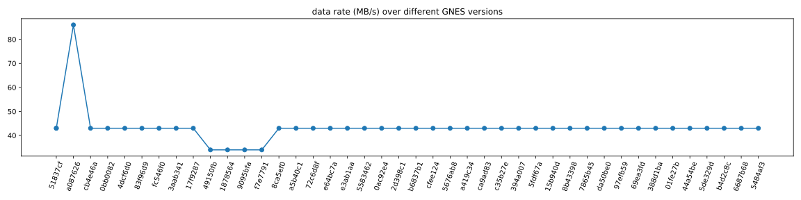
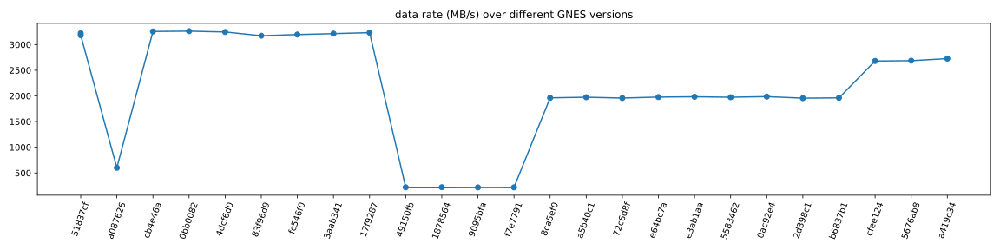
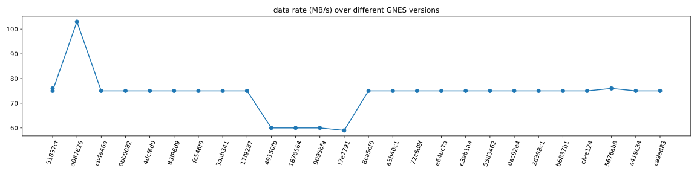

# Benchmarking GNES on Network Latency

<a href="https://drone.gnes.ai/gnes-ai/gnes"></a>

This repository tracks the network latency over different GNES versions. As a part of CICD pipeline, this repo gets automatically updated when the [GNES master](https://github.com/gnes-ai/gnes) is updated or a new [GNES version is released](https://github.com/gnes-ai/gnes/releases). 

Please don't change the content of this file manually, as it will be overwritten during the update anyway. 


## Experimental Setup

In this benchmark, we setup multiple workflows to represent typical pipelines in the everyday usage of GNES. We then do a "load testing" to determine the system's behavior under normal/peak conditions.

All experiments use `gnes/gnes:{version}-alpine` as the base image. All microservices are simplified using `BaseRouter` and `BlockRouter`.  

## Run Test

> For the purpose of evaluating this benchmark in CICD pipeline, some environment 

For example, to run the [third test case](#case-3-parallel-non-blocking-flow) on GNES version `latest-alpine`:  

```bash
export GNES_IMG_TAG=latest-alpine
export GNES_BENCHMARK_ID=3

make pull && make build && make test d=500 b=10 s=1000000 && make clean
```

The client will generate 500 documents with the batch size of 10, which yields 50 requests in total. Each document has the size of 1MB. Hence each request is 10MB.

Due to the memory limit of our CD node (t2-micro, 1GB memory), we better keep the number of document in this way.

## Explanation of the Table

Time units are in *seconds*, *the smaller the better*. Numbers are *the best average* over three runs.

### Time-related metrics

- `roundtrip`: the average latency in seconds for a request travel from `Frontend` and through the whole workflow and finally back to `Frontend`.
- `MB/s`: megabyte per second (MB/s) is a unit of data transfer rate over the whole workflow.
- `f:send`: the average latency in seconds between sending every two requests at the `Frontend`.
- `f:recv`: the average latency in seconds between receiving every two requests at the `Frontend`.
- `f->r1:send`: the average latency in seconds for `Router1` receiving a request sent from `Frontend`.
- `r1->r2:send`: the average latency in seconds for `Router2` receiving a request sent from `Router1` (or all `Router1` from the last layer).
- `r2->f:send`: the average latency in seconds for `Frontend` receiving a request sent from `Router2` (or all `Router2` from the last layer).

### Meta information

- `version_vcs`: corresponds to the `gnes-ai/gnes@` commit's SHA hash.
- `version_tag`: corresponds to the version tag of a GNES docker image.
- `timestamp_build`: timestamp when the docker image was built.
- `timestamp_eval`: timestamp when the benchmark was evaluated.

Table results are sorted by `timestamp_build` with the most recent build at first. 

## Case 1: Non-blocking Flow

The workflow is as follows:

<p align="center">
<a href="https://gnes.ai">

</a>
</p>

The ideal roundtrip latency is `0`. The smaller the better.

### Result

<p align="center">
<a href="https://gnes.ai">

</a>
</p>


<table border="0" class="dataframe">
  <thead>
    <tr style="text-align: right;">
      <th>version_vcs</th>
      <th>roundtrip</th>
      <th>MB/s</th>
      <th>f:send</th>
      <th>f:recv</th>
      <th>f->r1:send</th>
      <th>r1->r2:send</th>
      <th>r2->f:send</th>
      <th>timestamp_build</th>
      <th>timestamp_eval</th>
      <th>version_tag</th>
    </tr>
  </thead>
  <tbody>
    <tr>
      <td><a href="https://github.com/gnes-ai/gnes/commit/8b43398"><code>8b43398</code></a></td>
      <td>0.198</td>
      <td>2774</td>
      <td>0.133</td>
      <td>0.130</td>
      <td>0.043</td>
      <td>0.047</td>
      <td>0.100</td>
      <td>2019-10-17 11:28</td>
      <td>2019-10-17 11:54</td>
      <td><code>latest-alpine</code></td>
    </tr>
    <tr>
      <td><a href="https://github.com/gnes-ai/gnes/commit/15b940d"><code>15b940d</code></a></td>
      <td>0.201</td>
      <td>2730</td>
      <td>0.135</td>
      <td>0.130</td>
      <td>0.044</td>
      <td>0.046</td>
      <td>0.101</td>
      <td>2019-10-17 10:51</td>
      <td>2019-10-17 11:17</td>
      <td><code>v0.0.46-alpine</code></td>
    </tr>
    <tr>
      <td><a href="https://github.com/gnes-ai/gnes/commit/5fdf67a"><code>5fdf67a</code></a></td>
      <td>0.198</td>
      <td>2766</td>
      <td>0.133</td>
      <td>0.129</td>
      <td>0.043</td>
      <td>0.052</td>
      <td>0.100</td>
      <td>2019-10-17 10:14</td>
      <td>2019-10-17 10:41</td>
      <td><code>latest-alpine</code></td>
    </tr>
    <tr>
      <td><a href="https://github.com/gnes-ai/gnes/commit/394a007"><code>394a007</code></a></td>
      <td>0.199</td>
      <td>2771</td>
      <td>0.133</td>
      <td>0.130</td>
      <td>0.042</td>
      <td>0.048</td>
      <td>0.099</td>
      <td>2019-10-17 03:53</td>
      <td>2019-10-17 04:20</td>
      <td><code>latest-alpine</code></td>
    </tr>
    <tr>
      <td><a href="https://github.com/gnes-ai/gnes/commit/c35b27e"><code>c35b27e</code></a></td>
      <td>0.195</td>
      <td>2828</td>
      <td>0.132</td>
      <td>0.128</td>
      <td>0.042</td>
      <td>0.046</td>
      <td>0.098</td>
      <td>2019-10-17 03:16</td>
      <td>2019-10-17 03:43</td>
      <td><code>latest-alpine</code></td>
    </tr>
    <tr>
      <td><a href="https://github.com/gnes-ai/gnes/commit/ca9ad83"><code>ca9ad83</code></a></td>
      <td>0.199</td>
      <td>2741</td>
      <td>0.133</td>
      <td>0.129</td>
      <td>0.043</td>
      <td>0.045</td>
      <td>0.100</td>
      <td>2019-10-16 05:52</td>
      <td>2019-10-16 06:18</td>
      <td><code>latest-alpine</code></td>
    </tr>
    <tr>
      <td><a href="https://github.com/gnes-ai/gnes/commit/a419c34"><code>a419c34</code></a></td>
      <td>0.200</td>
      <td>2771</td>
      <td>0.133</td>
      <td>0.130</td>
      <td>0.041</td>
      <td>0.046</td>
      <td>0.100</td>
      <td>2019-10-16 03:08</td>
      <td>2019-10-16 03:31</td>
      <td><code>latest-alpine</code></td>
    </tr>
    <tr>
      <td><a href="https://github.com/gnes-ai/gnes/commit/5676ab8"><code>5676ab8</code></a></td>
      <td>0.199</td>
      <td>2771</td>
      <td>0.135</td>
      <td>0.131</td>
      <td>0.043</td>
      <td>0.047</td>
      <td>0.100</td>
      <td>2019-10-15 08:48</td>
      <td>2019-10-15 09:15</td>
      <td><code>latest-alpine</code></td>
    </tr>
    <tr>
      <td><a href="https://github.com/gnes-ai/gnes/commit/cfee124"><code>cfee124</code></a></td>
      <td>0.197</td>
      <td>2789</td>
      <td>0.133</td>
      <td>0.130</td>
      <td>0.042</td>
      <td>0.048</td>
      <td>0.099</td>
      <td>2019-10-15 08:11</td>
      <td>2019-10-15 08:38</td>
      <td><code>latest-alpine</code></td>
    </tr>
    <tr>
      <td><a href="https://github.com/gnes-ai/gnes/commit/b6837b1"><code>b6837b1</code></a></td>
      <td>0.261</td>
      <td>2002</td>
      <td>0.134</td>
      <td>0.130</td>
      <td>0.040</td>
      <td>0.052</td>
      <td>0.164</td>
      <td>2019-10-15 06:04</td>
      <td>2019-10-15 06:33</td>
      <td><code>v0.0.45-alpine</code></td>
    </tr>
    <tr>
      <td><a href="https://github.com/gnes-ai/gnes/commit/2d398c1"><code>2d398c1</code></a></td>
      <td>0.260</td>
      <td>2005</td>
      <td>0.134</td>
      <td>0.130</td>
      <td>0.040</td>
      <td>0.052</td>
      <td>0.164</td>
      <td>2019-10-15 04:53</td>
      <td>2019-10-15 05:20</td>
      <td><code>latest-alpine</code></td>
    </tr>
    <tr>
      <td><a href="https://github.com/gnes-ai/gnes/commit/0ac92e4"><code>0ac92e4</code></a></td>
      <td>0.257</td>
      <td>2027</td>
      <td>0.133</td>
      <td>0.128</td>
      <td>0.039</td>
      <td>0.051</td>
      <td>0.162</td>
      <td>2019-10-14 11:50</td>
      <td>2019-10-14 12:17</td>
      <td><code>latest-alpine</code></td>
    </tr>
    <tr>
      <td><a href="https://github.com/gnes-ai/gnes/commit/5583462"><code>5583462</code></a></td>
      <td>0.259</td>
      <td>2011</td>
      <td>0.133</td>
      <td>0.129</td>
      <td>0.039</td>
      <td>0.045</td>
      <td>0.164</td>
      <td>2019-10-14 09:07</td>
      <td>2019-10-14 09:34</td>
      <td><code>latest-alpine</code></td>
    </tr>
    <tr>
      <td><a href="https://github.com/gnes-ai/gnes/commit/e3ab1aa"><code>e3ab1aa</code></a></td>
      <td>0.260</td>
      <td>2017</td>
      <td>0.134</td>
      <td>0.130</td>
      <td>0.040</td>
      <td>0.045</td>
      <td>0.165</td>
      <td>2019-10-12 05:41</td>
      <td>2019-10-12 06:07</td>
      <td><code>latest-alpine</code></td>
    </tr>
    <tr>
      <td><a href="https://github.com/gnes-ai/gnes/commit/e64bc7a"><code>e64bc7a</code></a></td>
      <td>0.254</td>
      <td>2049</td>
      <td>0.131</td>
      <td>0.127</td>
      <td>0.039</td>
      <td>0.051</td>
      <td>0.161</td>
      <td>2019-10-11 13:11</td>
      <td>2019-10-11 13:38</td>
      <td><code>latest-alpine</code></td>
    </tr>
    <tr>
      <td><a href="https://github.com/gnes-ai/gnes/commit/72c6d8f"><code>72c6d8f</code></a></td>
      <td>0.258</td>
      <td>2023</td>
      <td>0.133</td>
      <td>0.129</td>
      <td>0.039</td>
      <td>0.051</td>
      <td>0.163</td>
      <td>2019-10-11 08:08</td>
      <td>2019-10-11 08:35</td>
      <td><code>latest-alpine</code></td>
    </tr>
    <tr>
      <td><a href="https://github.com/gnes-ai/gnes/commit/a5b40c1"><code>a5b40c1</code></a></td>
      <td>0.259</td>
      <td>2012</td>
      <td>0.133</td>
      <td>0.129</td>
      <td>0.040</td>
      <td>0.052</td>
      <td>0.164</td>
      <td>2019-10-11 07:31</td>
      <td>2019-10-11 07:58</td>
      <td><code>v0.0.44-alpine</code></td>
    </tr>
    <tr>
      <td><a href="https://github.com/gnes-ai/gnes/commit/8ca5ef0"><code>8ca5ef0</code></a></td>
      <td>0.256</td>
      <td>2035</td>
      <td>0.132</td>
      <td>0.127</td>
      <td>0.040</td>
      <td>0.051</td>
      <td>0.161</td>
      <td>2019-10-11 05:48</td>
      <td>2019-10-11 06:15</td>
      <td><code>latest-alpine</code></td>
    </tr>
    <tr>
      <td><a href="https://github.com/gnes-ai/gnes/commit/f7e7791"><code>f7e7791</code></a></td>
      <td>3.300</td>
      <td>228</td>
      <td>0.124</td>
      <td>0.010</td>
      <td>0.054</td>
      <td>0.053</td>
      <td>3.189</td>
      <td>2019-10-11 04:20</td>
      <td>2019-10-11 04:47</td>
      <td><code>latest-alpine</code></td>
    </tr>
    <tr>
      <td><a href="https://github.com/gnes-ai/gnes/commit/9095bfa"><code>9095bfa</code></a></td>
      <td>3.295</td>
      <td>229</td>
      <td>0.124</td>
      <td>0.010</td>
      <td>0.054</td>
      <td>0.052</td>
      <td>3.184</td>
      <td>2019-10-10 11:45</td>
      <td>2019-10-10 12:12</td>
      <td><code>latest-alpine</code></td>
    </tr>
    <tr>
      <td><a href="https://github.com/gnes-ai/gnes/commit/1878564"><code>1878564</code></a></td>
      <td>3.317</td>
      <td>226</td>
      <td>0.124</td>
      <td>0.010</td>
      <td>0.054</td>
      <td>0.046</td>
      <td>3.206</td>
      <td>2019-10-10 11:00</td>
      <td>2019-10-10 11:34</td>
      <td><code>latest-alpine</code></td>
    </tr>
    <tr>
      <td><a href="https://github.com/gnes-ai/gnes/commit/49150fb"><code>49150fb</code></a></td>
      <td>3.314</td>
      <td>227</td>
      <td>0.123</td>
      <td>0.010</td>
      <td>0.053</td>
      <td>0.046</td>
      <td>3.204</td>
      <td>2019-10-10 04:51</td>
      <td>2019-10-10 05:18</td>
      <td><code>latest-alpine</code></td>
    </tr>
    <tr>
      <td><a href="https://github.com/gnes-ai/gnes/commit/17f9287"><code>17f9287</code></a></td>
      <td>0.161</td>
      <td>3148</td>
      <td>0.127</td>
      <td>0.125</td>
      <td>0.032</td>
      <td>0.051</td>
      <td>0.069</td>
      <td>2019-10-10 00:33</td>
      <td>2019-10-10 01:00</td>
      <td><code>latest-alpine</code></td>
    </tr>
    <tr>
      <td><a href="https://github.com/gnes-ai/gnes/commit/3aab341"><code>3aab341</code></a></td>
      <td>0.161</td>
      <td>3150</td>
      <td>0.129</td>
      <td>0.127</td>
      <td>0.032</td>
      <td>0.052</td>
      <td>0.068</td>
      <td>2019-10-09 10:15</td>
      <td>2019-10-09 10:39</td>
      <td><code>latest-alpine</code></td>
    </tr>
    <tr>
      <td><a href="https://github.com/gnes-ai/gnes/commit/fc546f0"><code>fc546f0</code></a></td>
      <td>0.160</td>
      <td>3166</td>
      <td>0.128</td>
      <td>0.126</td>
      <td>0.032</td>
      <td>0.047</td>
      <td>0.068</td>
      <td>2019-09-30 09:41</td>
      <td>2019-09-30 10:08</td>
      <td><code>v0.0.43-alpine</code></td>
    </tr>
    <tr>
      <td><a href="https://github.com/gnes-ai/gnes/commit/83f96d9"><code>83f96d9</code></a></td>
      <td>0.160</td>
      <td>3171</td>
      <td>0.127</td>
      <td>0.126</td>
      <td>0.032</td>
      <td>0.048</td>
      <td>0.068</td>
      <td>2019-09-29 12:34</td>
      <td>2019-09-29 13:01</td>
      <td><code>latest-alpine</code></td>
    </tr>
    <tr>
      <td><a href="https://github.com/gnes-ai/gnes/commit/4dcf6d0"><code>4dcf6d0</code></a></td>
      <td>0.159</td>
      <td>3185</td>
      <td>0.127</td>
      <td>0.125</td>
      <td>0.031</td>
      <td>0.050</td>
      <td>0.068</td>
      <td>2019-09-29 11:57</td>
      <td>2019-09-29 12:24</td>
      <td><code>latest-alpine</code></td>
    </tr>
    <tr>
      <td><a href="https://github.com/gnes-ai/gnes/commit/0bb0082"><code>0bb0082</code></a></td>
      <td>0.160</td>
      <td>3172</td>
      <td>0.128</td>
      <td>0.126</td>
      <td>0.031</td>
      <td>0.048</td>
      <td>0.068</td>
      <td>2019-09-29 11:23</td>
      <td>2019-09-29 11:47</td>
      <td><code>latest-alpine</code></td>
    </tr>
    <tr>
      <td><a href="https://github.com/gnes-ai/gnes/commit/cb4e46a"><code>cb4e46a</code></a></td>
      <td>0.159</td>
      <td>3182</td>
      <td>0.127</td>
      <td>0.126</td>
      <td>0.031</td>
      <td>0.047</td>
      <td>0.068</td>
      <td>2019-09-29 04:07</td>
      <td>2019-09-29 04:34</td>
      <td><code>latest-alpine</code></td>
    </tr>
    <tr>
      <td><a href="https://github.com/gnes-ai/gnes/commit/a087626"><code>a087626</code></a></td>
      <td>2.534</td>
      <td>727</td>
      <td>1.114</td>
      <td>1.052</td>
      <td>0.537</td>
      <td>0.478</td>
      <td>1.491</td>
      <td>2019-09-27 11:05</td>
      <td>2019-09-27 11:35</td>
      <td><code>latest-alpine</code></td>
    </tr>
    <tr>
      <td><a href="https://github.com/gnes-ai/gnes/commit/51837cf"><code>51837cf</code></a></td>
      <td>0.160</td>
      <td>3166</td>
      <td>0.128</td>
      <td>0.126</td>
      <td>0.031</td>
      <td>0.050</td>
      <td>0.067</td>
      <td>2019-09-27 06:36</td>
      <td>2019-09-27 10:44</td>
      <td><code>latest-alpine</code></td>
    </tr>
    <tr>
      <td><a href="https://github.com/gnes-ai/gnes/commit/51837cf"><code>51837cf</code></a></td>
      <td>0.155</td>
      <td>3258</td>
      <td>0.124</td>
      <td>0.123</td>
      <td>0.032</td>
      <td>0.047</td>
      <td>0.064</td>
      <td>2019-09-27 06:36</td>
      <td>2019-09-27 10:29</td>
      <td><code>latest-alpine</code></td>
    </tr>
  </tbody>
</table>

## Case 2: Blocking Flow

The workflow is as follows:

<p align="center">
<a href="https://gnes.ai">

</a>
</p>

It simulates a pipeline with uneven workload, `Router2` block the pipeline for 1s.

Hence, a naive synchronized pipeline will take 50s to finish 50 requests.

### Result

<p align="center">
<a href="https://gnes.ai">

</a>
</p>


<table border="0" class="dataframe">
  <thead>
    <tr style="text-align: right;">
      <th>version_vcs</th>
      <th>roundtrip</th>
      <th>MB/s</th>
      <th>f:send</th>
      <th>f:recv</th>
      <th>f->r1:send</th>
      <th>r1->r2:send</th>
      <th>r2->f:send</th>
      <th>timestamp_build</th>
      <th>timestamp_eval</th>
      <th>version_tag</th>
    </tr>
  </thead>
  <tbody>
    <tr>
      <td><a href="https://github.com/gnes-ai/gnes/commit/8b43398"><code>8b43398</code></a></td>
      <td>24.212</td>
      <td>43</td>
      <td>0.095</td>
      <td>1.035</td>
      <td>0.039</td>
      <td>23.117</td>
      <td>0.038</td>
      <td>2019-10-17 11:28</td>
      <td>2019-10-17 11:58</td>
      <td><code>latest-alpine</code></td>
    </tr>
    <tr>
      <td><a href="https://github.com/gnes-ai/gnes/commit/15b940d"><code>15b940d</code></a></td>
      <td>24.164</td>
      <td>43</td>
      <td>0.095</td>
      <td>1.035</td>
      <td>0.038</td>
      <td>23.080</td>
      <td>0.037</td>
      <td>2019-10-17 10:51</td>
      <td>2019-10-17 11:21</td>
      <td><code>v0.0.46-alpine</code></td>
    </tr>
    <tr>
      <td><a href="https://github.com/gnes-ai/gnes/commit/5fdf67a"><code>5fdf67a</code></a></td>
      <td>24.161</td>
      <td>43</td>
      <td>0.095</td>
      <td>1.035</td>
      <td>0.039</td>
      <td>23.076</td>
      <td>0.036</td>
      <td>2019-10-17 10:14</td>
      <td>2019-10-17 10:44</td>
      <td><code>latest-alpine</code></td>
    </tr>
    <tr>
      <td><a href="https://github.com/gnes-ai/gnes/commit/394a007"><code>394a007</code></a></td>
      <td>24.218</td>
      <td>43</td>
      <td>0.095</td>
      <td>1.035</td>
      <td>0.038</td>
      <td>23.134</td>
      <td>0.036</td>
      <td>2019-10-17 03:53</td>
      <td>2019-10-17 04:23</td>
      <td><code>latest-alpine</code></td>
    </tr>
    <tr>
      <td><a href="https://github.com/gnes-ai/gnes/commit/c35b27e"><code>c35b27e</code></a></td>
      <td>24.208</td>
      <td>43</td>
      <td>0.096</td>
      <td>1.035</td>
      <td>0.039</td>
      <td>23.121</td>
      <td>0.035</td>
      <td>2019-10-17 03:16</td>
      <td>2019-10-17 03:46</td>
      <td><code>latest-alpine</code></td>
    </tr>
    <tr>
      <td><a href="https://github.com/gnes-ai/gnes/commit/ca9ad83"><code>ca9ad83</code></a></td>
      <td>24.230</td>
      <td>43</td>
      <td>0.095</td>
      <td>1.035</td>
      <td>0.038</td>
      <td>23.150</td>
      <td>0.034</td>
      <td>2019-10-16 05:52</td>
      <td>2019-10-16 06:22</td>
      <td><code>latest-alpine</code></td>
    </tr>
    <tr>
      <td><a href="https://github.com/gnes-ai/gnes/commit/a419c34"><code>a419c34</code></a></td>
      <td>24.173</td>
      <td>43</td>
      <td>0.096</td>
      <td>1.035</td>
      <td>0.040</td>
      <td>23.087</td>
      <td>0.037</td>
      <td>2019-10-16 03:08</td>
      <td>2019-10-16 03:34</td>
      <td><code>latest-alpine</code></td>
    </tr>
    <tr>
      <td><a href="https://github.com/gnes-ai/gnes/commit/5676ab8"><code>5676ab8</code></a></td>
      <td>24.209</td>
      <td>43</td>
      <td>0.097</td>
      <td>1.035</td>
      <td>0.040</td>
      <td>23.117</td>
      <td>0.036</td>
      <td>2019-10-15 08:48</td>
      <td>2019-10-15 09:18</td>
      <td><code>latest-alpine</code></td>
    </tr>
    <tr>
      <td><a href="https://github.com/gnes-ai/gnes/commit/cfee124"><code>cfee124</code></a></td>
      <td>24.164</td>
      <td>43</td>
      <td>0.095</td>
      <td>1.035</td>
      <td>0.039</td>
      <td>23.079</td>
      <td>0.035</td>
      <td>2019-10-15 08:11</td>
      <td>2019-10-15 08:41</td>
      <td><code>latest-alpine</code></td>
    </tr>
    <tr>
      <td><a href="https://github.com/gnes-ai/gnes/commit/b6837b1"><code>b6837b1</code></a></td>
      <td>24.171</td>
      <td>43</td>
      <td>0.095</td>
      <td>1.036</td>
      <td>0.041</td>
      <td>23.084</td>
      <td>0.037</td>
      <td>2019-10-15 06:04</td>
      <td>2019-10-15 06:36</td>
      <td><code>v0.0.45-alpine</code></td>
    </tr>
    <tr>
      <td><a href="https://github.com/gnes-ai/gnes/commit/2d398c1"><code>2d398c1</code></a></td>
      <td>24.246</td>
      <td>43</td>
      <td>0.095</td>
      <td>1.036</td>
      <td>0.039</td>
      <td>23.161</td>
      <td>0.036</td>
      <td>2019-10-15 04:53</td>
      <td>2019-10-15 05:24</td>
      <td><code>latest-alpine</code></td>
    </tr>
    <tr>
      <td><a href="https://github.com/gnes-ai/gnes/commit/0ac92e4"><code>0ac92e4</code></a></td>
      <td>24.160</td>
      <td>43</td>
      <td>0.094</td>
      <td>1.035</td>
      <td>0.040</td>
      <td>23.074</td>
      <td>0.036</td>
      <td>2019-10-14 11:50</td>
      <td>2019-10-14 12:20</td>
      <td><code>latest-alpine</code></td>
    </tr>
    <tr>
      <td><a href="https://github.com/gnes-ai/gnes/commit/5583462"><code>5583462</code></a></td>
      <td>24.193</td>
      <td>43</td>
      <td>0.094</td>
      <td>1.036</td>
      <td>0.039</td>
      <td>23.106</td>
      <td>0.037</td>
      <td>2019-10-14 09:07</td>
      <td>2019-10-14 09:37</td>
      <td><code>latest-alpine</code></td>
    </tr>
    <tr>
      <td><a href="https://github.com/gnes-ai/gnes/commit/e3ab1aa"><code>e3ab1aa</code></a></td>
      <td>24.251</td>
      <td>43</td>
      <td>0.094</td>
      <td>1.035</td>
      <td>0.041</td>
      <td>23.165</td>
      <td>0.037</td>
      <td>2019-10-12 05:41</td>
      <td>2019-10-12 06:11</td>
      <td><code>latest-alpine</code></td>
    </tr>
    <tr>
      <td><a href="https://github.com/gnes-ai/gnes/commit/e64bc7a"><code>e64bc7a</code></a></td>
      <td>24.223</td>
      <td>43</td>
      <td>0.093</td>
      <td>1.035</td>
      <td>0.038</td>
      <td>23.140</td>
      <td>0.035</td>
      <td>2019-10-11 13:11</td>
      <td>2019-10-11 13:41</td>
      <td><code>latest-alpine</code></td>
    </tr>
    <tr>
      <td><a href="https://github.com/gnes-ai/gnes/commit/72c6d8f"><code>72c6d8f</code></a></td>
      <td>24.242</td>
      <td>43</td>
      <td>0.094</td>
      <td>1.036</td>
      <td>0.040</td>
      <td>23.151</td>
      <td>0.036</td>
      <td>2019-10-11 08:08</td>
      <td>2019-10-11 08:39</td>
      <td><code>latest-alpine</code></td>
    </tr>
    <tr>
      <td><a href="https://github.com/gnes-ai/gnes/commit/a5b40c1"><code>a5b40c1</code></a></td>
      <td>24.221</td>
      <td>43</td>
      <td>0.096</td>
      <td>1.036</td>
      <td>0.040</td>
      <td>23.131</td>
      <td>0.036</td>
      <td>2019-10-11 07:31</td>
      <td>2019-10-11 08:01</td>
      <td><code>v0.0.44-alpine</code></td>
    </tr>
    <tr>
      <td><a href="https://github.com/gnes-ai/gnes/commit/8ca5ef0"><code>8ca5ef0</code></a></td>
      <td>24.227</td>
      <td>43</td>
      <td>0.096</td>
      <td>1.036</td>
      <td>0.040</td>
      <td>23.135</td>
      <td>0.036</td>
      <td>2019-10-11 05:48</td>
      <td>2019-10-11 06:18</td>
      <td><code>latest-alpine</code></td>
    </tr>
    <tr>
      <td><a href="https://github.com/gnes-ai/gnes/commit/f7e7791"><code>f7e7791</code></a></td>
      <td>24.435</td>
      <td>34</td>
      <td>0.093</td>
      <td>0.967</td>
      <td>0.041</td>
      <td>23.201</td>
      <td>0.183</td>
      <td>2019-10-11 04:20</td>
      <td>2019-10-11 04:50</td>
      <td><code>latest-alpine</code></td>
    </tr>
    <tr>
      <td><a href="https://github.com/gnes-ai/gnes/commit/9095bfa"><code>9095bfa</code></a></td>
      <td>24.432</td>
      <td>34</td>
      <td>0.093</td>
      <td>0.965</td>
      <td>0.042</td>
      <td>23.196</td>
      <td>0.180</td>
      <td>2019-10-10 11:45</td>
      <td>2019-10-10 12:15</td>
      <td><code>latest-alpine</code></td>
    </tr>
    <tr>
      <td><a href="https://github.com/gnes-ai/gnes/commit/1878564"><code>1878564</code></a></td>
      <td>24.456</td>
      <td>34</td>
      <td>0.093</td>
      <td>0.967</td>
      <td>0.041</td>
      <td>23.222</td>
      <td>0.182</td>
      <td>2019-10-10 11:00</td>
      <td>2019-10-10 11:38</td>
      <td><code>latest-alpine</code></td>
    </tr>
    <tr>
      <td><a href="https://github.com/gnes-ai/gnes/commit/49150fb"><code>49150fb</code></a></td>
      <td>24.423</td>
      <td>34</td>
      <td>0.094</td>
      <td>0.966</td>
      <td>0.043</td>
      <td>23.185</td>
      <td>0.183</td>
      <td>2019-10-10 04:51</td>
      <td>2019-10-10 05:21</td>
      <td><code>latest-alpine</code></td>
    </tr>
    <tr>
      <td><a href="https://github.com/gnes-ai/gnes/commit/17f9287"><code>17f9287</code></a></td>
      <td>24.236</td>
      <td>43</td>
      <td>0.092</td>
      <td>1.034</td>
      <td>0.037</td>
      <td>23.152</td>
      <td>0.035</td>
      <td>2019-10-10 00:33</td>
      <td>2019-10-10 01:03</td>
      <td><code>latest-alpine</code></td>
    </tr>
    <tr>
      <td><a href="https://github.com/gnes-ai/gnes/commit/3aab341"><code>3aab341</code></a></td>
      <td>24.280</td>
      <td>43</td>
      <td>0.092</td>
      <td>1.035</td>
      <td>0.038</td>
      <td>23.198</td>
      <td>0.036</td>
      <td>2019-10-09 10:15</td>
      <td>2019-10-09 10:43</td>
      <td><code>latest-alpine</code></td>
    </tr>
    <tr>
      <td><a href="https://github.com/gnes-ai/gnes/commit/fc546f0"><code>fc546f0</code></a></td>
      <td>24.227</td>
      <td>43</td>
      <td>0.092</td>
      <td>1.035</td>
      <td>0.038</td>
      <td>23.132</td>
      <td>0.036</td>
      <td>2019-09-30 09:41</td>
      <td>2019-09-30 10:11</td>
      <td><code>v0.0.43-alpine</code></td>
    </tr>
    <tr>
      <td><a href="https://github.com/gnes-ai/gnes/commit/83f96d9"><code>83f96d9</code></a></td>
      <td>24.250</td>
      <td>43</td>
      <td>0.093</td>
      <td>1.034</td>
      <td>0.038</td>
      <td>23.166</td>
      <td>0.037</td>
      <td>2019-09-29 12:34</td>
      <td>2019-09-29 13:05</td>
      <td><code>latest-alpine</code></td>
    </tr>
    <tr>
      <td><a href="https://github.com/gnes-ai/gnes/commit/4dcf6d0"><code>4dcf6d0</code></a></td>
      <td>24.220</td>
      <td>43</td>
      <td>0.092</td>
      <td>1.035</td>
      <td>0.037</td>
      <td>23.138</td>
      <td>0.034</td>
      <td>2019-09-29 11:57</td>
      <td>2019-09-29 12:27</td>
      <td><code>latest-alpine</code></td>
    </tr>
    <tr>
      <td><a href="https://github.com/gnes-ai/gnes/commit/0bb0082"><code>0bb0082</code></a></td>
      <td>24.203</td>
      <td>43</td>
      <td>0.092</td>
      <td>1.033</td>
      <td>0.038</td>
      <td>23.111</td>
      <td>0.037</td>
      <td>2019-09-29 11:23</td>
      <td>2019-09-29 11:50</td>
      <td><code>latest-alpine</code></td>
    </tr>
    <tr>
      <td><a href="https://github.com/gnes-ai/gnes/commit/cb4e46a"><code>cb4e46a</code></a></td>
      <td>24.255</td>
      <td>43</td>
      <td>0.092</td>
      <td>1.034</td>
      <td>0.037</td>
      <td>23.170</td>
      <td>0.037</td>
      <td>2019-09-29 04:07</td>
      <td>2019-09-29 04:37</td>
      <td><code>latest-alpine</code></td>
    </tr>
    <tr>
      <td><a href="https://github.com/gnes-ai/gnes/commit/a087626"><code>a087626</code></a></td>
      <td>5.928</td>
      <td>86</td>
      <td>0.184</td>
      <td>1.265</td>
      <td>0.099</td>
      <td>2.134</td>
      <td>0.341</td>
      <td>2019-09-27 11:05</td>
      <td>2019-09-27 11:39</td>
      <td><code>latest-alpine</code></td>
    </tr>
    <tr>
      <td><a href="https://github.com/gnes-ai/gnes/commit/51837cf"><code>51837cf</code></a></td>
      <td>24.246</td>
      <td>43</td>
      <td>0.092</td>
      <td>1.035</td>
      <td>0.037</td>
      <td>23.164</td>
      <td>0.035</td>
      <td>2019-09-27 06:36</td>
      <td>2019-09-27 10:47</td>
      <td><code>latest-alpine</code></td>
    </tr>
    <tr>
      <td><a href="https://github.com/gnes-ai/gnes/commit/51837cf"><code>51837cf</code></a></td>
      <td>24.304</td>
      <td>43</td>
      <td>0.091</td>
      <td>1.035</td>
      <td>0.037</td>
      <td>23.220</td>
      <td>0.036</td>
      <td>2019-09-27 06:36</td>
      <td>2019-09-27 10:32</td>
      <td><code>latest-alpine</code></td>
    </tr>
  </tbody>
</table>

## Case 3: Parallel Non-blocking Flow

The workflow is as follows:

<p align="center">
<a href="https://gnes.ai">

</a>
</p>

The ideal roundtrip latency is `0`. The smaller the better.

### Result

<p align="center">
<a href="https://gnes.ai">

</a>
</p>


<table border="0" class="dataframe">
  <thead>
    <tr style="text-align: right;">
      <th>version_vcs</th>
      <th>roundtrip</th>
      <th>MB/s</th>
      <th>f:send</th>
      <th>f:recv</th>
      <th>f->r1:send</th>
      <th>r1->r2:send</th>
      <th>r2->f:send</th>
      <th>timestamp_build</th>
      <th>timestamp_eval</th>
      <th>version_tag</th>
    </tr>
  </thead>
  <tbody>
    <tr>
      <td><a href="https://github.com/gnes-ai/gnes/commit/8b43398"><code>8b43398</code></a></td>
      <td>0.206</td>
      <td>2634</td>
      <td>0.137</td>
      <td>0.133</td>
      <td>0.046</td>
      <td>0.048</td>
      <td>0.101</td>
      <td>2019-10-17 11:28</td>
      <td>2019-10-17 11:59</td>
      <td><code>latest-alpine</code></td>
    </tr>
    <tr>
      <td><a href="https://github.com/gnes-ai/gnes/commit/15b940d"><code>15b940d</code></a></td>
      <td>0.206</td>
      <td>2642</td>
      <td>0.137</td>
      <td>0.133</td>
      <td>0.045</td>
      <td>0.049</td>
      <td>0.101</td>
      <td>2019-10-17 10:51</td>
      <td>2019-10-17 11:22</td>
      <td><code>v0.0.46-alpine</code></td>
    </tr>
    <tr>
      <td><a href="https://github.com/gnes-ai/gnes/commit/5fdf67a"><code>5fdf67a</code></a></td>
      <td>0.203</td>
      <td>2702</td>
      <td>0.137</td>
      <td>0.132</td>
      <td>0.045</td>
      <td>0.053</td>
      <td>0.100</td>
      <td>2019-10-17 10:14</td>
      <td>2019-10-17 10:45</td>
      <td><code>latest-alpine</code></td>
    </tr>
    <tr>
      <td><a href="https://github.com/gnes-ai/gnes/commit/394a007"><code>394a007</code></a></td>
      <td>0.203</td>
      <td>2675</td>
      <td>0.135</td>
      <td>0.132</td>
      <td>0.045</td>
      <td>0.047</td>
      <td>0.100</td>
      <td>2019-10-17 03:53</td>
      <td>2019-10-17 04:25</td>
      <td><code>latest-alpine</code></td>
    </tr>
    <tr>
      <td><a href="https://github.com/gnes-ai/gnes/commit/c35b27e"><code>c35b27e</code></a></td>
      <td>0.204</td>
      <td>2656</td>
      <td>0.136</td>
      <td>0.132</td>
      <td>0.045</td>
      <td>0.049</td>
      <td>0.100</td>
      <td>2019-10-17 03:16</td>
      <td>2019-10-17 03:48</td>
      <td><code>latest-alpine</code></td>
    </tr>
    <tr>
      <td><a href="https://github.com/gnes-ai/gnes/commit/ca9ad83"><code>ca9ad83</code></a></td>
      <td>0.208</td>
      <td>2614</td>
      <td>0.137</td>
      <td>0.133</td>
      <td>0.045</td>
      <td>0.048</td>
      <td>0.103</td>
      <td>2019-10-16 05:52</td>
      <td>2019-10-16 06:23</td>
      <td><code>latest-alpine</code></td>
    </tr>
    <tr>
      <td><a href="https://github.com/gnes-ai/gnes/commit/a419c34"><code>a419c34</code></a></td>
      <td>0.199</td>
      <td>2727</td>
      <td>0.135</td>
      <td>0.131</td>
      <td>0.045</td>
      <td>0.051</td>
      <td>0.098</td>
      <td>2019-10-16 03:08</td>
      <td>2019-10-16 03:36</td>
      <td><code>latest-alpine</code></td>
    </tr>
    <tr>
      <td><a href="https://github.com/gnes-ai/gnes/commit/5676ab8"><code>5676ab8</code></a></td>
      <td>0.205</td>
      <td>2686</td>
      <td>0.138</td>
      <td>0.133</td>
      <td>0.046</td>
      <td>0.051</td>
      <td>0.101</td>
      <td>2019-10-15 08:48</td>
      <td>2019-10-15 09:20</td>
      <td><code>latest-alpine</code></td>
    </tr>
    <tr>
      <td><a href="https://github.com/gnes-ai/gnes/commit/cfee124"><code>cfee124</code></a></td>
      <td>0.203</td>
      <td>2680</td>
      <td>0.135</td>
      <td>0.131</td>
      <td>0.045</td>
      <td>0.053</td>
      <td>0.100</td>
      <td>2019-10-15 08:11</td>
      <td>2019-10-15 08:43</td>
      <td><code>latest-alpine</code></td>
    </tr>
    <tr>
      <td><a href="https://github.com/gnes-ai/gnes/commit/b6837b1"><code>b6837b1</code></a></td>
      <td>0.266</td>
      <td>1962</td>
      <td>0.137</td>
      <td>0.133</td>
      <td>0.042</td>
      <td>0.047</td>
      <td>0.167</td>
      <td>2019-10-15 06:04</td>
      <td>2019-10-15 06:37</td>
      <td><code>v0.0.45-alpine</code></td>
    </tr>
    <tr>
      <td><a href="https://github.com/gnes-ai/gnes/commit/2d398c1"><code>2d398c1</code></a></td>
      <td>0.266</td>
      <td>1956</td>
      <td>0.137</td>
      <td>0.133</td>
      <td>0.042</td>
      <td>0.047</td>
      <td>0.167</td>
      <td>2019-10-15 04:53</td>
      <td>2019-10-15 05:25</td>
      <td><code>latest-alpine</code></td>
    </tr>
    <tr>
      <td><a href="https://github.com/gnes-ai/gnes/commit/0ac92e4"><code>0ac92e4</code></a></td>
      <td>0.262</td>
      <td>1986</td>
      <td>0.135</td>
      <td>0.131</td>
      <td>0.041</td>
      <td>0.052</td>
      <td>0.163</td>
      <td>2019-10-14 11:50</td>
      <td>2019-10-14 12:21</td>
      <td><code>latest-alpine</code></td>
    </tr>
    <tr>
      <td><a href="https://github.com/gnes-ai/gnes/commit/5583462"><code>5583462</code></a></td>
      <td>0.264</td>
      <td>1974</td>
      <td>0.136</td>
      <td>0.131</td>
      <td>0.042</td>
      <td>0.048</td>
      <td>0.164</td>
      <td>2019-10-14 09:07</td>
      <td>2019-10-14 09:39</td>
      <td><code>latest-alpine</code></td>
    </tr>
    <tr>
      <td><a href="https://github.com/gnes-ai/gnes/commit/e3ab1aa"><code>e3ab1aa</code></a></td>
      <td>0.263</td>
      <td>1983</td>
      <td>0.135</td>
      <td>0.131</td>
      <td>0.041</td>
      <td>0.049</td>
      <td>0.164</td>
      <td>2019-10-12 05:41</td>
      <td>2019-10-12 06:12</td>
      <td><code>latest-alpine</code></td>
    </tr>
    <tr>
      <td><a href="https://github.com/gnes-ai/gnes/commit/e64bc7a"><code>e64bc7a</code></a></td>
      <td>0.264</td>
      <td>1977</td>
      <td>0.136</td>
      <td>0.132</td>
      <td>0.042</td>
      <td>0.053</td>
      <td>0.164</td>
      <td>2019-10-11 13:11</td>
      <td>2019-10-11 13:42</td>
      <td><code>latest-alpine</code></td>
    </tr>
    <tr>
      <td><a href="https://github.com/gnes-ai/gnes/commit/72c6d8f"><code>72c6d8f</code></a></td>
      <td>0.266</td>
      <td>1958</td>
      <td>0.137</td>
      <td>0.133</td>
      <td>0.041</td>
      <td>0.053</td>
      <td>0.166</td>
      <td>2019-10-11 08:08</td>
      <td>2019-10-11 08:40</td>
      <td><code>latest-alpine</code></td>
    </tr>
    <tr>
      <td><a href="https://github.com/gnes-ai/gnes/commit/a5b40c1"><code>a5b40c1</code></a></td>
      <td>0.263</td>
      <td>1974</td>
      <td>0.135</td>
      <td>0.131</td>
      <td>0.042</td>
      <td>0.052</td>
      <td>0.164</td>
      <td>2019-10-11 07:31</td>
      <td>2019-10-11 08:02</td>
      <td><code>v0.0.44-alpine</code></td>
    </tr>
    <tr>
      <td><a href="https://github.com/gnes-ai/gnes/commit/8ca5ef0"><code>8ca5ef0</code></a></td>
      <td>0.265</td>
      <td>1962</td>
      <td>0.136</td>
      <td>0.132</td>
      <td>0.042</td>
      <td>0.054</td>
      <td>0.165</td>
      <td>2019-10-11 05:48</td>
      <td>2019-10-11 06:19</td>
      <td><code>latest-alpine</code></td>
    </tr>
    <tr>
      <td><a href="https://github.com/gnes-ai/gnes/commit/f7e7791"><code>f7e7791</code></a></td>
      <td>3.383</td>
      <td>220</td>
      <td>0.126</td>
      <td>0.010</td>
      <td>0.058</td>
      <td>0.052</td>
      <td>3.268</td>
      <td>2019-10-11 04:20</td>
      <td>2019-10-11 04:51</td>
      <td><code>latest-alpine</code></td>
    </tr>
    <tr>
      <td><a href="https://github.com/gnes-ai/gnes/commit/9095bfa"><code>9095bfa</code></a></td>
      <td>3.430</td>
      <td>219</td>
      <td>0.128</td>
      <td>0.010</td>
      <td>0.058</td>
      <td>0.054</td>
      <td>3.313</td>
      <td>2019-10-10 11:45</td>
      <td>2019-10-10 12:16</td>
      <td><code>latest-alpine</code></td>
    </tr>
    <tr>
      <td><a href="https://github.com/gnes-ai/gnes/commit/1878564"><code>1878564</code></a></td>
      <td>3.411</td>
      <td>222</td>
      <td>0.127</td>
      <td>0.010</td>
      <td>0.059</td>
      <td>0.054</td>
      <td>3.293</td>
      <td>2019-10-10 11:00</td>
      <td>2019-10-10 11:39</td>
      <td><code>latest-alpine</code></td>
    </tr>
    <tr>
      <td><a href="https://github.com/gnes-ai/gnes/commit/49150fb"><code>49150fb</code></a></td>
      <td>3.398</td>
      <td>221</td>
      <td>0.127</td>
      <td>0.010</td>
      <td>0.058</td>
      <td>0.047</td>
      <td>3.281</td>
      <td>2019-10-10 04:51</td>
      <td>2019-10-10 05:22</td>
      <td><code>latest-alpine</code></td>
    </tr>
    <tr>
      <td><a href="https://github.com/gnes-ai/gnes/commit/17f9287"><code>17f9287</code></a></td>
      <td>0.157</td>
      <td>3232</td>
      <td>0.126</td>
      <td>0.124</td>
      <td>0.031</td>
      <td>0.047</td>
      <td>0.063</td>
      <td>2019-10-10 00:33</td>
      <td>2019-10-10 01:05</td>
      <td><code>latest-alpine</code></td>
    </tr>
    <tr>
      <td><a href="https://github.com/gnes-ai/gnes/commit/3aab341"><code>3aab341</code></a></td>
      <td>0.158</td>
      <td>3213</td>
      <td>0.127</td>
      <td>0.125</td>
      <td>0.031</td>
      <td>0.052</td>
      <td>0.063</td>
      <td>2019-10-09 10:15</td>
      <td>2019-10-09 10:44</td>
      <td><code>latest-alpine</code></td>
    </tr>
    <tr>
      <td><a href="https://github.com/gnes-ai/gnes/commit/fc546f0"><code>fc546f0</code></a></td>
      <td>0.159</td>
      <td>3195</td>
      <td>0.127</td>
      <td>0.123</td>
      <td>0.031</td>
      <td>0.052</td>
      <td>0.064</td>
      <td>2019-09-30 09:41</td>
      <td>2019-09-30 10:12</td>
      <td><code>v0.0.43-alpine</code></td>
    </tr>
    <tr>
      <td><a href="https://github.com/gnes-ai/gnes/commit/83f96d9"><code>83f96d9</code></a></td>
      <td>0.160</td>
      <td>3172</td>
      <td>0.128</td>
      <td>0.127</td>
      <td>0.032</td>
      <td>0.053</td>
      <td>0.063</td>
      <td>2019-09-29 12:34</td>
      <td>2019-09-29 13:06</td>
      <td><code>latest-alpine</code></td>
    </tr>
    <tr>
      <td><a href="https://github.com/gnes-ai/gnes/commit/4dcf6d0"><code>4dcf6d0</code></a></td>
      <td>0.156</td>
      <td>3245</td>
      <td>0.126</td>
      <td>0.124</td>
      <td>0.031</td>
      <td>0.053</td>
      <td>0.062</td>
      <td>2019-09-29 11:57</td>
      <td>2019-09-29 12:29</td>
      <td><code>latest-alpine</code></td>
    </tr>
    <tr>
      <td><a href="https://github.com/gnes-ai/gnes/commit/0bb0082"><code>0bb0082</code></a></td>
      <td>0.155</td>
      <td>3261</td>
      <td>0.125</td>
      <td>0.124</td>
      <td>0.030</td>
      <td>0.050</td>
      <td>0.064</td>
      <td>2019-09-29 11:23</td>
      <td>2019-09-29 11:51</td>
      <td><code>latest-alpine</code></td>
    </tr>
    <tr>
      <td><a href="https://github.com/gnes-ai/gnes/commit/cb4e46a"><code>cb4e46a</code></a></td>
      <td>0.156</td>
      <td>3255</td>
      <td>0.125</td>
      <td>0.124</td>
      <td>0.031</td>
      <td>0.052</td>
      <td>0.063</td>
      <td>2019-09-29 04:07</td>
      <td>2019-09-29 04:38</td>
      <td><code>latest-alpine</code></td>
    </tr>
    <tr>
      <td><a href="https://github.com/gnes-ai/gnes/commit/a087626"><code>a087626</code></a></td>
      <td>1.623</td>
      <td>601</td>
      <td>0.688</td>
      <td>0.703</td>
      <td>0.351</td>
      <td>0.300</td>
      <td>0.953</td>
      <td>2019-09-27 11:05</td>
      <td>2019-09-27 11:43</td>
      <td><code>latest-alpine</code></td>
    </tr>
    <tr>
      <td><a href="https://github.com/gnes-ai/gnes/commit/51837cf"><code>51837cf</code></a></td>
      <td>0.159</td>
      <td>3181</td>
      <td>0.128</td>
      <td>0.126</td>
      <td>0.032</td>
      <td>0.055</td>
      <td>0.063</td>
      <td>2019-09-27 06:36</td>
      <td>2019-09-27 10:48</td>
      <td><code>latest-alpine</code></td>
    </tr>
    <tr>
      <td><a href="https://github.com/gnes-ai/gnes/commit/51837cf"><code>51837cf</code></a></td>
      <td>0.157</td>
      <td>3221</td>
      <td>0.126</td>
      <td>0.125</td>
      <td>0.032</td>
      <td>0.053</td>
      <td>0.062</td>
      <td>2019-09-27 06:36</td>
      <td>2019-09-27 10:34</td>
      <td><code>latest-alpine</code></td>
    </tr>
  </tbody>
</table>

## Case 4: Parallel Blocking Flow

The workflow is as follows:

<p align="center">
<a href="https://gnes.ai">

</a>
</p>

It simulates a parallel pipeline with heavy workload. Both `Router1` and `Router2` will block the pipeline for 1s.

As `Router1` and `Router2` are parallel, a naive synchronized implementation will take 25s to finish 50 requests.

### Result

<p align="center">
<a href="https://gnes.ai">

</a>
</p>


<table border="0" class="dataframe">
  <thead>
    <tr style="text-align: right;">
      <th>version_vcs</th>
      <th>roundtrip</th>
      <th>MB/s</th>
      <th>f:send</th>
      <th>f:recv</th>
      <th>f->r1:send</th>
      <th>r1->r2:send</th>
      <th>r2->f:send</th>
      <th>timestamp_build</th>
      <th>timestamp_eval</th>
      <th>version_tag</th>
    </tr>
  </thead>
  <tbody>
    <tr>
      <td><a href="https://github.com/gnes-ai/gnes/commit/8b43398"><code>8b43398</code></a></td>
      <td>11.715</td>
      <td>75</td>
      <td>0.078</td>
      <td>0.508</td>
      <td>10.640</td>
      <td>0.029</td>
      <td>0.035</td>
      <td>2019-10-17 11:28</td>
      <td>2019-10-17 12:01</td>
      <td><code>latest-alpine</code></td>
    </tr>
    <tr>
      <td><a href="https://github.com/gnes-ai/gnes/commit/15b940d"><code>15b940d</code></a></td>
      <td>11.746</td>
      <td>75</td>
      <td>0.077</td>
      <td>0.507</td>
      <td>10.669</td>
      <td>0.031</td>
      <td>0.036</td>
      <td>2019-10-17 10:51</td>
      <td>2019-10-17 11:24</td>
      <td><code>v0.0.46-alpine</code></td>
    </tr>
    <tr>
      <td><a href="https://github.com/gnes-ai/gnes/commit/5fdf67a"><code>5fdf67a</code></a></td>
      <td>11.710</td>
      <td>75</td>
      <td>0.078</td>
      <td>0.507</td>
      <td>10.634</td>
      <td>0.030</td>
      <td>0.035</td>
      <td>2019-10-17 10:14</td>
      <td>2019-10-17 10:47</td>
      <td><code>latest-alpine</code></td>
    </tr>
    <tr>
      <td><a href="https://github.com/gnes-ai/gnes/commit/394a007"><code>394a007</code></a></td>
      <td>11.713</td>
      <td>76</td>
      <td>0.078</td>
      <td>0.507</td>
      <td>10.638</td>
      <td>0.030</td>
      <td>0.032</td>
      <td>2019-10-17 03:53</td>
      <td>2019-10-17 04:27</td>
      <td><code>latest-alpine</code></td>
    </tr>
    <tr>
      <td><a href="https://github.com/gnes-ai/gnes/commit/c35b27e"><code>c35b27e</code></a></td>
      <td>11.710</td>
      <td>75</td>
      <td>0.077</td>
      <td>0.507</td>
      <td>10.635</td>
      <td>0.030</td>
      <td>0.036</td>
      <td>2019-10-17 03:16</td>
      <td>2019-10-17 03:50</td>
      <td><code>latest-alpine</code></td>
    </tr>
    <tr>
      <td><a href="https://github.com/gnes-ai/gnes/commit/ca9ad83"><code>ca9ad83</code></a></td>
      <td>11.721</td>
      <td>75</td>
      <td>0.079</td>
      <td>0.508</td>
      <td>10.643</td>
      <td>0.031</td>
      <td>0.034</td>
      <td>2019-10-16 05:52</td>
      <td>2019-10-16 06:25</td>
      <td><code>latest-alpine</code></td>
    </tr>
    <tr>
      <td><a href="https://github.com/gnes-ai/gnes/commit/a419c34"><code>a419c34</code></a></td>
      <td>11.727</td>
      <td>75</td>
      <td>0.077</td>
      <td>0.508</td>
      <td>10.652</td>
      <td>0.031</td>
      <td>0.036</td>
      <td>2019-10-16 03:08</td>
      <td>2019-10-16 03:38</td>
      <td><code>latest-alpine</code></td>
    </tr>
    <tr>
      <td><a href="https://github.com/gnes-ai/gnes/commit/5676ab8"><code>5676ab8</code></a></td>
      <td>11.722</td>
      <td>76</td>
      <td>0.078</td>
      <td>0.508</td>
      <td>10.647</td>
      <td>0.030</td>
      <td>0.033</td>
      <td>2019-10-15 08:48</td>
      <td>2019-10-15 09:22</td>
      <td><code>latest-alpine</code></td>
    </tr>
    <tr>
      <td><a href="https://github.com/gnes-ai/gnes/commit/cfee124"><code>cfee124</code></a></td>
      <td>11.727</td>
      <td>75</td>
      <td>0.078</td>
      <td>0.508</td>
      <td>10.650</td>
      <td>0.031</td>
      <td>0.035</td>
      <td>2019-10-15 08:11</td>
      <td>2019-10-15 08:45</td>
      <td><code>latest-alpine</code></td>
    </tr>
    <tr>
      <td><a href="https://github.com/gnes-ai/gnes/commit/b6837b1"><code>b6837b1</code></a></td>
      <td>11.705</td>
      <td>75</td>
      <td>0.078</td>
      <td>0.507</td>
      <td>10.626</td>
      <td>0.030</td>
      <td>0.037</td>
      <td>2019-10-15 06:04</td>
      <td>2019-10-15 06:40</td>
      <td><code>v0.0.45-alpine</code></td>
    </tr>
    <tr>
      <td><a href="https://github.com/gnes-ai/gnes/commit/2d398c1"><code>2d398c1</code></a></td>
      <td>11.731</td>
      <td>75</td>
      <td>0.077</td>
      <td>0.507</td>
      <td>10.650</td>
      <td>0.030</td>
      <td>0.039</td>
      <td>2019-10-15 04:53</td>
      <td>2019-10-15 05:27</td>
      <td><code>latest-alpine</code></td>
    </tr>
    <tr>
      <td><a href="https://github.com/gnes-ai/gnes/commit/0ac92e4"><code>0ac92e4</code></a></td>
      <td>11.721</td>
      <td>75</td>
      <td>0.077</td>
      <td>0.508</td>
      <td>10.641</td>
      <td>0.029</td>
      <td>0.034</td>
      <td>2019-10-14 11:50</td>
      <td>2019-10-14 12:24</td>
      <td><code>latest-alpine</code></td>
    </tr>
    <tr>
      <td><a href="https://github.com/gnes-ai/gnes/commit/5583462"><code>5583462</code></a></td>
      <td>11.741</td>
      <td>75</td>
      <td>0.076</td>
      <td>0.508</td>
      <td>10.666</td>
      <td>0.031</td>
      <td>0.036</td>
      <td>2019-10-14 09:07</td>
      <td>2019-10-14 09:41</td>
      <td><code>latest-alpine</code></td>
    </tr>
    <tr>
      <td><a href="https://github.com/gnes-ai/gnes/commit/e3ab1aa"><code>e3ab1aa</code></a></td>
      <td>11.720</td>
      <td>75</td>
      <td>0.076</td>
      <td>0.508</td>
      <td>10.640</td>
      <td>0.030</td>
      <td>0.039</td>
      <td>2019-10-12 05:41</td>
      <td>2019-10-12 06:14</td>
      <td><code>latest-alpine</code></td>
    </tr>
    <tr>
      <td><a href="https://github.com/gnes-ai/gnes/commit/e64bc7a"><code>e64bc7a</code></a></td>
      <td>11.745</td>
      <td>75</td>
      <td>0.078</td>
      <td>0.508</td>
      <td>10.665</td>
      <td>0.030</td>
      <td>0.032</td>
      <td>2019-10-11 13:11</td>
      <td>2019-10-11 13:44</td>
      <td><code>latest-alpine</code></td>
    </tr>
    <tr>
      <td><a href="https://github.com/gnes-ai/gnes/commit/72c6d8f"><code>72c6d8f</code></a></td>
      <td>11.723</td>
      <td>75</td>
      <td>0.078</td>
      <td>0.508</td>
      <td>10.641</td>
      <td>0.030</td>
      <td>0.032</td>
      <td>2019-10-11 08:08</td>
      <td>2019-10-11 08:42</td>
      <td><code>latest-alpine</code></td>
    </tr>
    <tr>
      <td><a href="https://github.com/gnes-ai/gnes/commit/a5b40c1"><code>a5b40c1</code></a></td>
      <td>11.721</td>
      <td>75</td>
      <td>0.076</td>
      <td>0.508</td>
      <td>10.644</td>
      <td>0.030</td>
      <td>0.037</td>
      <td>2019-10-11 07:31</td>
      <td>2019-10-11 08:04</td>
      <td><code>v0.0.44-alpine</code></td>
    </tr>
    <tr>
      <td><a href="https://github.com/gnes-ai/gnes/commit/8ca5ef0"><code>8ca5ef0</code></a></td>
      <td>11.759</td>
      <td>75</td>
      <td>0.077</td>
      <td>0.508</td>
      <td>10.681</td>
      <td>0.030</td>
      <td>0.032</td>
      <td>2019-10-11 05:48</td>
      <td>2019-10-11 06:21</td>
      <td><code>latest-alpine</code></td>
    </tr>
    <tr>
      <td><a href="https://github.com/gnes-ai/gnes/commit/f7e7791"><code>f7e7791</code></a></td>
      <td>11.948</td>
      <td>59</td>
      <td>0.076</td>
      <td>0.456</td>
      <td>10.693</td>
      <td>0.031</td>
      <td>0.210</td>
      <td>2019-10-11 04:20</td>
      <td>2019-10-11 04:53</td>
      <td><code>latest-alpine</code></td>
    </tr>
    <tr>
      <td><a href="https://github.com/gnes-ai/gnes/commit/9095bfa"><code>9095bfa</code></a></td>
      <td>11.954</td>
      <td>60</td>
      <td>0.077</td>
      <td>0.457</td>
      <td>10.701</td>
      <td>0.032</td>
      <td>0.208</td>
      <td>2019-10-10 11:45</td>
      <td>2019-10-10 12:18</td>
      <td><code>latest-alpine</code></td>
    </tr>
    <tr>
      <td><a href="https://github.com/gnes-ai/gnes/commit/1878564"><code>1878564</code></a></td>
      <td>11.964</td>
      <td>60</td>
      <td>0.076</td>
      <td>0.457</td>
      <td>10.718</td>
      <td>0.031</td>
      <td>0.206</td>
      <td>2019-10-10 11:00</td>
      <td>2019-10-10 11:41</td>
      <td><code>latest-alpine</code></td>
    </tr>
    <tr>
      <td><a href="https://github.com/gnes-ai/gnes/commit/49150fb"><code>49150fb</code></a></td>
      <td>11.946</td>
      <td>60</td>
      <td>0.075</td>
      <td>0.457</td>
      <td>10.694</td>
      <td>0.030</td>
      <td>0.206</td>
      <td>2019-10-10 04:51</td>
      <td>2019-10-10 05:24</td>
      <td><code>latest-alpine</code></td>
    </tr>
    <tr>
      <td><a href="https://github.com/gnes-ai/gnes/commit/17f9287"><code>17f9287</code></a></td>
      <td>11.845</td>
      <td>75</td>
      <td>0.075</td>
      <td>0.509</td>
      <td>10.767</td>
      <td>0.030</td>
      <td>0.032</td>
      <td>2019-10-10 00:33</td>
      <td>2019-10-10 01:07</td>
      <td><code>latest-alpine</code></td>
    </tr>
    <tr>
      <td><a href="https://github.com/gnes-ai/gnes/commit/3aab341"><code>3aab341</code></a></td>
      <td>11.841</td>
      <td>75</td>
      <td>0.075</td>
      <td>0.507</td>
      <td>10.755</td>
      <td>0.031</td>
      <td>0.030</td>
      <td>2019-10-09 10:15</td>
      <td>2019-10-09 10:46</td>
      <td><code>latest-alpine</code></td>
    </tr>
    <tr>
      <td><a href="https://github.com/gnes-ai/gnes/commit/fc546f0"><code>fc546f0</code></a></td>
      <td>11.820</td>
      <td>75</td>
      <td>0.074</td>
      <td>0.508</td>
      <td>10.741</td>
      <td>0.032</td>
      <td>0.036</td>
      <td>2019-09-30 09:41</td>
      <td>2019-09-30 10:14</td>
      <td><code>v0.0.43-alpine</code></td>
    </tr>
    <tr>
      <td><a href="https://github.com/gnes-ai/gnes/commit/83f96d9"><code>83f96d9</code></a></td>
      <td>11.824</td>
      <td>75</td>
      <td>0.075</td>
      <td>0.508</td>
      <td>10.750</td>
      <td>0.030</td>
      <td>0.032</td>
      <td>2019-09-29 12:34</td>
      <td>2019-09-29 13:08</td>
      <td><code>latest-alpine</code></td>
    </tr>
    <tr>
      <td><a href="https://github.com/gnes-ai/gnes/commit/4dcf6d0"><code>4dcf6d0</code></a></td>
      <td>11.837</td>
      <td>75</td>
      <td>0.075</td>
      <td>0.508</td>
      <td>10.761</td>
      <td>0.032</td>
      <td>0.034</td>
      <td>2019-09-29 11:57</td>
      <td>2019-09-29 12:31</td>
      <td><code>latest-alpine</code></td>
    </tr>
    <tr>
      <td><a href="https://github.com/gnes-ai/gnes/commit/0bb0082"><code>0bb0082</code></a></td>
      <td>11.834</td>
      <td>75</td>
      <td>0.074</td>
      <td>0.508</td>
      <td>10.757</td>
      <td>0.030</td>
      <td>0.035</td>
      <td>2019-09-29 11:23</td>
      <td>2019-09-29 11:54</td>
      <td><code>latest-alpine</code></td>
    </tr>
    <tr>
      <td><a href="https://github.com/gnes-ai/gnes/commit/cb4e46a"><code>cb4e46a</code></a></td>
      <td>11.820</td>
      <td>75</td>
      <td>0.073</td>
      <td>0.507</td>
      <td>10.742</td>
      <td>0.031</td>
      <td>0.038</td>
      <td>2019-09-29 04:07</td>
      <td>2019-09-29 04:41</td>
      <td><code>latest-alpine</code></td>
    </tr>
    <tr>
      <td><a href="https://github.com/gnes-ai/gnes/commit/a087626"><code>a087626</code></a></td>
      <td>5.022</td>
      <td>103</td>
      <td>0.081</td>
      <td>0.633</td>
      <td>0.837</td>
      <td>0.344</td>
      <td>0.289</td>
      <td>2019-09-27 11:05</td>
      <td>2019-09-27 11:48</td>
      <td><code>latest-alpine</code></td>
    </tr>
    <tr>
      <td><a href="https://github.com/gnes-ai/gnes/commit/51837cf"><code>51837cf</code></a></td>
      <td>11.856</td>
      <td>75</td>
      <td>0.075</td>
      <td>0.509</td>
      <td>10.783</td>
      <td>0.031</td>
      <td>0.033</td>
      <td>2019-09-27 06:36</td>
      <td>2019-09-27 10:51</td>
      <td><code>latest-alpine</code></td>
    </tr>
    <tr>
      <td><a href="https://github.com/gnes-ai/gnes/commit/51837cf"><code>51837cf</code></a></td>
      <td>11.834</td>
      <td>76</td>
      <td>0.074</td>
      <td>0.508</td>
      <td>10.759</td>
      <td>0.030</td>
      <td>0.033</td>
      <td>2019-09-27 06:36</td>
      <td>2019-09-27 10:36</td>
      <td><code>latest-alpine</code></td>
    </tr>
  </tbody>
</table>