# Benchmarking GNES on Network Latency

<a href="https://drone.gnes.ai/gnes-ai/gnes"></a>

This repository tracks the network latency over different GNES versions. As a part of CICD pipeline, this repo gets automatically updated when the [GNES master](https://github.com/gnes-ai/gnes) is updated or a new [GNES version is released](https://github.com/gnes-ai/gnes/releases). 

Please don't change the content of this file manually, as it will be overwritten during the update anyway. 


## Experimental Setup

In this benchmark, we setup multiple workflows to represent typical pipelines in the everyday usage of GNES. We then do a "load testing" to determine the system's behavior under normal/peak conditions.

All experiments use `gnes/gnes:{version}-alpine` as the base image. All microservices are simplified using `BaseRouter` and `BlockRouter`.  

## Run Test

> For the purpose of evaluating this benchmark in CICD pipeline, some environment 

For example, to run the [third test case](#case-3-parallel-non-blocking-flow) on GNES version `latest-alpine`:  

```bash
export GNES_IMG_TAG=latest-alpine
export GNES_BENCHMARK_ID=3

make pull && make build && make test d=500 b=10 s=1000000 && make clean
```

The client will generate 500 documents with the batch size of 10, which yields 50 requests in total. Each document has the size of 1MB. Hence each request is 10MB.

Due to the memory limit of our CD node (t2-micro, 1GB memory), we better keep the number of document in this way.

## Explanation of the Table

Time units are in *seconds*, *the smaller the better*. Numbers are *the best average* over three runs.

### Time-related metrics

- `roundtrip`: the average latency in seconds for a request travel from `Frontend` and through the whole workflow and finally back to `Frontend`.
- `MB/s`: megabyte per second (MB/s) is a unit of data transfer rate over the whole workflow.
- `f:send`: the average latency in seconds between sending every two requests at the `Frontend`.
- `f:recv`: the average latency in seconds between receiving every two requests at the `Frontend`.
- `f->r1:send`: the average latency in seconds for `Router1` receiving a request sent from `Frontend`.
- `r1->r2:send`: the average latency in seconds for `Router2` receiving a request sent from `Router1` (or all `Router1` from the last layer).
- `r2->f:send`: the average latency in seconds for `Frontend` receiving a request sent from `Router2` (or all `Router2` from the last layer).

### Meta information

- `version_vcs`: corresponds to the `gnes-ai/gnes@` commit's SHA hash.
- `version_tag`: corresponds to the version tag of a GNES docker image.
- `timestamp_build`: timestamp when the docker image was built.
- `timestamp_eval`: timestamp when the benchmark was evaluated.

Table results are sorted by `timestamp_build` with the most recent build at first. 

## Case 1: Non-blocking Flow

The workflow is as follows:

<p align="center">
<a href="https://gnes.ai">

</a>
</p>

The ideal roundtrip latency is `0`. The smaller the better.

### Result

<table border="0" class="dataframe">
  <thead>
    <tr style="text-align: right;">
      <th>version_vcs</th>
      <th>roundtrip</th>
      <th>MB/s</th>
      <th>f:send</th>
      <th>f:recv</th>
      <th>f->r1:send</th>
      <th>r1->r2:send</th>
      <th>r2->f:send</th>
      <th>timestamp_build</th>
      <th>timestamp_eval</th>
      <th>version_tag</th>
    </tr>
  </thead>
  <tbody>
    <tr>
      <td><a href="https://github.com/gnes-ai/gnes/commit/51837cf"><code>51837cf</code></a></td>
      <td>0.155</td>
      <td>3258</td>
      <td>0.124</td>
      <td>0.123</td>
      <td>0.032</td>
      <td>0.047</td>
      <td>0.064</td>
      <td>2019-09-27 06:36:57+00:00</td>
      <td>2019-09-27 10:29:20.479615927</td>
      <td><code>latest-alpine</code></td>
    </tr>
    <tr>
      <td><a href="https://github.com/gnes-ai/gnes/commit/51837cf"><code>51837cf</code></a></td>
      <td>0.160</td>
      <td>3166</td>
      <td>0.128</td>
      <td>0.126</td>
      <td>0.031</td>
      <td>0.050</td>
      <td>0.067</td>
      <td>2019-09-27 06:36:57+00:00</td>
      <td>2019-09-27 10:44:13.799331903</td>
      <td><code>latest-alpine</code></td>
    </tr>
    <tr>
      <td><a href="https://github.com/gnes-ai/gnes/commit/a087626"><code>a087626</code></a></td>
      <td>2.534</td>
      <td>727</td>
      <td>1.114</td>
      <td>1.052</td>
      <td>0.537</td>
      <td>0.478</td>
      <td>1.491</td>
      <td>2019-09-27 11:05:51+00:00</td>
      <td>2019-09-27 11:35:17.971560001</td>
      <td><code>latest-alpine</code></td>
    </tr>
  </tbody>
</table>

## Case 2: Blocking Flow

The workflow is as follows:

<p align="center">
<a href="https://gnes.ai">

</a>
</p>

It simulates a pipeline with uneven workload, `Router2` block the pipeline for 1s.

Hence, a naive synchronized pipeline will take 50s to finish 50 requests.

### Result

<table border="0" class="dataframe">
  <thead>
    <tr style="text-align: right;">
      <th>version_vcs</th>
      <th>roundtrip</th>
      <th>MB/s</th>
      <th>f:send</th>
      <th>f:recv</th>
      <th>f->r1:send</th>
      <th>r1->r2:send</th>
      <th>r2->f:send</th>
      <th>timestamp_build</th>
      <th>timestamp_eval</th>
      <th>version_tag</th>
    </tr>
  </thead>
  <tbody>
    <tr>
      <td><a href="https://github.com/gnes-ai/gnes/commit/51837cf"><code>51837cf</code></a></td>
      <td>24.304</td>
      <td>43</td>
      <td>0.091</td>
      <td>1.035</td>
      <td>0.037</td>
      <td>23.220</td>
      <td>0.036</td>
      <td>2019-09-27 06:36:57+00:00</td>
      <td>2019-09-27 10:32:42.967658043</td>
      <td><code>latest-alpine</code></td>
    </tr>
    <tr>
      <td><a href="https://github.com/gnes-ai/gnes/commit/51837cf"><code>51837cf</code></a></td>
      <td>24.246</td>
      <td>43</td>
      <td>0.092</td>
      <td>1.035</td>
      <td>0.037</td>
      <td>23.164</td>
      <td>0.035</td>
      <td>2019-09-27 06:36:57+00:00</td>
      <td>2019-09-27 10:47:36.011617899</td>
      <td><code>latest-alpine</code></td>
    </tr>
    <tr>
      <td><a href="https://github.com/gnes-ai/gnes/commit/a087626"><code>a087626</code></a></td>
      <td>5.928</td>
      <td>86</td>
      <td>0.184</td>
      <td>1.265</td>
      <td>0.099</td>
      <td>2.134</td>
      <td>0.341</td>
      <td>2019-09-27 11:05:51+00:00</td>
      <td>2019-09-27 11:39:50.737411976</td>
      <td><code>latest-alpine</code></td>
    </tr>
  </tbody>
</table>

## Case 3: Parallel Non-blocking Flow

The workflow is as follows:

<p align="center">
<a href="https://gnes.ai">

</a>
</p>

The ideal roundtrip latency is `0`. The smaller the better.

### Result

<table border="0" class="dataframe">
  <thead>
    <tr style="text-align: right;">
      <th>version_vcs</th>
      <th>roundtrip</th>
      <th>MB/s</th>
      <th>f:send</th>
      <th>f:recv</th>
      <th>f->r1:send</th>
      <th>r1->r2:send</th>
      <th>r2->f:send</th>
      <th>timestamp_build</th>
      <th>timestamp_eval</th>
      <th>version_tag</th>
    </tr>
  </thead>
  <tbody>
    <tr>
      <td><a href="https://github.com/gnes-ai/gnes/commit/51837cf"><code>51837cf</code></a></td>
      <td>0.157</td>
      <td>3221</td>
      <td>0.126</td>
      <td>0.125</td>
      <td>0.032</td>
      <td>0.053</td>
      <td>0.062</td>
      <td>2019-09-27 06:36:57+00:00</td>
      <td>2019-09-27 10:34:00.315649986</td>
      <td><code>latest-alpine</code></td>
    </tr>
    <tr>
      <td><a href="https://github.com/gnes-ai/gnes/commit/51837cf"><code>51837cf</code></a></td>
      <td>0.159</td>
      <td>3181</td>
      <td>0.128</td>
      <td>0.126</td>
      <td>0.032</td>
      <td>0.055</td>
      <td>0.063</td>
      <td>2019-09-27 06:36:57+00:00</td>
      <td>2019-09-27 10:48:53.461021900</td>
      <td><code>latest-alpine</code></td>
    </tr>
    <tr>
      <td><a href="https://github.com/gnes-ai/gnes/commit/a087626"><code>a087626</code></a></td>
      <td>1.623</td>
      <td>601</td>
      <td>0.688</td>
      <td>0.703</td>
      <td>0.351</td>
      <td>0.300</td>
      <td>0.953</td>
      <td>2019-09-27 11:05:51+00:00</td>
      <td>2019-09-27 11:43:46.868346930</td>
      <td><code>latest-alpine</code></td>
    </tr>
  </tbody>
</table>

## Case 4: Parallel Blocking Flow

The workflow is as follows:

<p align="center">
<a href="https://gnes.ai">

</a>
</p>

It simulates a parallel pipeline with heavy workload. Both `Router1` and `Router2` will block the pipeline for 1s.

As `Router1` and `Router2` are parallel, a naive synchronized implementation will take 25s to finish 50 requests.

### Result

<table border="0" class="dataframe">
  <thead>
    <tr style="text-align: right;">
      <th>version_vcs</th>
      <th>roundtrip</th>
      <th>MB/s</th>
      <th>f:send</th>
      <th>f:recv</th>
      <th>f->r1:send</th>
      <th>r1->r2:send</th>
      <th>r2->f:send</th>
      <th>timestamp_build</th>
      <th>timestamp_eval</th>
      <th>version_tag</th>
    </tr>
  </thead>
  <tbody>
    <tr>
      <td><a href="https://github.com/gnes-ai/gnes/commit/51837cf"><code>51837cf</code></a></td>
      <td>11.834</td>
      <td>76</td>
      <td>0.074</td>
      <td>0.508</td>
      <td>10.759</td>
      <td>0.030</td>
      <td>0.033</td>
      <td>2019-09-27 06:36:57+00:00</td>
      <td>2019-09-27 10:36:05.778395891</td>
      <td><code>latest-alpine</code></td>
    </tr>
    <tr>
      <td><a href="https://github.com/gnes-ai/gnes/commit/51837cf"><code>51837cf</code></a></td>
      <td>11.856</td>
      <td>75</td>
      <td>0.075</td>
      <td>0.509</td>
      <td>10.783</td>
      <td>0.031</td>
      <td>0.033</td>
      <td>2019-09-27 06:36:57+00:00</td>
      <td>2019-09-27 10:51:00.759022951</td>
      <td><code>latest-alpine</code></td>
    </tr>
    <tr>
      <td><a href="https://github.com/gnes-ai/gnes/commit/a087626"><code>a087626</code></a></td>
      <td>5.022</td>
      <td>103</td>
      <td>0.081</td>
      <td>0.633</td>
      <td>0.837</td>
      <td>0.344</td>
      <td>0.289</td>
      <td>2019-09-27 11:05:51+00:00</td>
      <td>2019-09-27 11:48:18.011820078</td>
      <td><code>latest-alpine</code></td>
    </tr>
  </tbody>
</table>